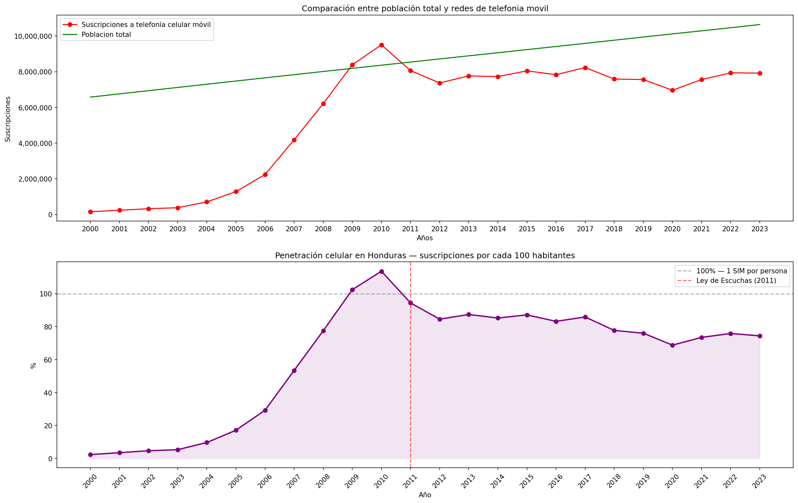

## When More SIMs Than People Isn't Growth: Honduras Mobile Data Analysis

##Important

----
This was my first data project, built to learn the basic workflow of data extraction, cleaning, and visualization. For a more complete example of my current skill level, see the Central America Debt Analysis project.
----

## Goal
To analyze the historical behavior of mobile network subscriptions in Honduras and understand why the market reached an anomalous peak and why it is unlikely to recover those levels.

## Skills
Data analysis, data cleaning, hypothesis testing, data visualization.

## Technology
Python, Pandas, Matplotlib.

## What does this analysis show?
Based on data provided by the World Bank over a period of 23 years (2000–2023), we can observe significant variability in mobile network subscriptions in Honduras. By comparing subscription numbers against total population, we calculate a penetration rate that reveals a market anomaly: at its peak in 2010, Honduras reported more active SIM cards than its entire population.

## Visualizations

## Why did subscriptions fall so sharply?
Between 2000 and 2010, Honduras experienced explosive growth in mobile subscriptions — from 2.36% penetration to 113.62%. This growth was fueled by the rapid expansion of mobile carriers and the ease of acquiring anonymous prepaid SIM cards, often for as little as $1. Many users held multiple SIMs from different carriers to take advantage of lower in-network call rates, and carriers counted every issued SIM as an active subscription regardless of actual usage.

In 2011, the Honduran Congress approved the **Ley Especial sobre Intervención de las Comunicaciones Privadas**, which required all carriers to register every SIM card to a verified national ID. Any unregistered or inactive line had to be deactivated within 90 days. As a direct consequence, carriers purged millions of ghost lines from their databases, causing the sharp statistical drop visible between 2011 and 2012 — from 113.62% to 84.57% penetration in a single year.

The decline was not a collapse of the market. It was a correction of inflated data.

## Why is it unlikely to return to that peak?
Three structural reasons prevent a return to 113% penetration:

1. **Regulatory barriers** — The 2011 law eliminated the anonymous SIM market that inflated the original numbers. Every new line now requires formal registration, making mass accumulation of unused SIMs impractical.
2. **Market saturation** — Every Honduran who can afford a mobile subscription already has one. The addressable market has reached its natural ceiling.
3. **Changing usage patterns** — The original incentive for holding multiple SIMs (cheaper in-network calls) has been largely eliminated by messaging apps and flat-rate data plans.

As of 2023, penetration has stabilized at 74.41% — a figure that more accurately reflects genuine, active mobile usage in Honduras than the 2010 peak ever did.

## Source
World Bank — World Development Indicators, Honduras 2000–2023  
data.worldbank.org
